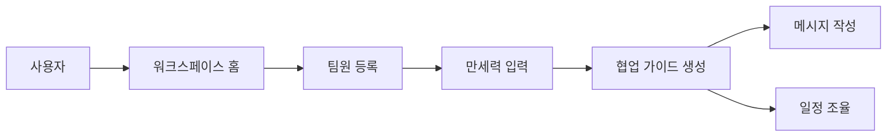
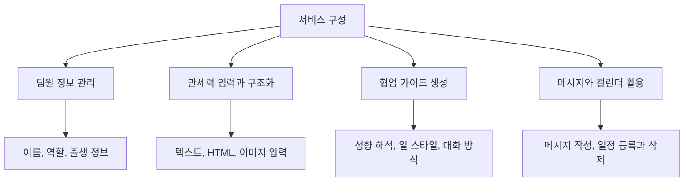

# greenblock 설계 문서

## 서비스 소개

greenblock은 팀원의 성향과 협업 맥락을 바탕으로 메시지, 일정, 협업 요청 방식을 정리해 보여주는 협업 서비스다.

## 문서 목록

- [00-service-overview.md](C:/Users/82109/Desktop/greenblock/docs/software-engineering/00-service-overview.md)
- [01-use-case-model.md](C:/Users/82109/Desktop/greenblock/docs/software-engineering/01-use-case-model.md)
- [02-api-specification.md](C:/Users/82109/Desktop/greenblock/docs/software-engineering/02-api-specification.md)
- [03-functional-specification.md](C:/Users/82109/Desktop/greenblock/docs/software-engineering/03-functional-specification.md)
- [04-test-cases.md](C:/Users/82109/Desktop/greenblock/docs/software-engineering/04-test-cases.md)
- [05-architecture-and-nfr.md](C:/Users/82109/Desktop/greenblock/docs/software-engineering/05-architecture-and-nfr.md)
