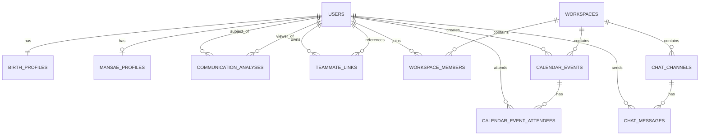

# Greenblock ERD Draft

This first draft is normalized to reduce duplicated profile data and protect referential integrity.

## Flow confirmation

1. Login -> Workspace Home -> Register Teammate -> Analysis Result -> Message Recommendation
2. Login -> Workspace Home -> Calendar

## Main design choices

- `users` stores identity and auth-related fields.
- `birth_profiles` is separated so birth data is stored once per user, including birth place name and optional latitude/longitude.
- `mansae_profiles` stores mansae output once per user, separate from raw identity.
- `communication_analyses` stores interpretation output and can vary by viewer if needed.
- `teammate_links` models "my teammate list" without duplicating user records.
- `calendar_events` and `calendar_event_attendees` normalize event ownership and attendees.
- `chat_channels` and `chat_messages` keep collaboration data separate from profile data.

## Mermaid ERD

