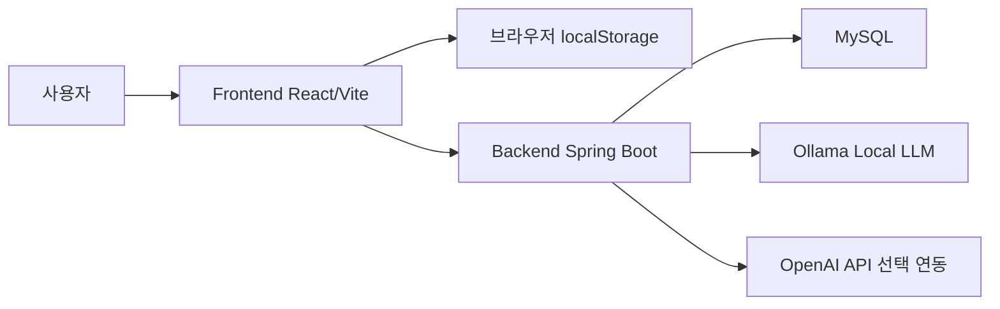
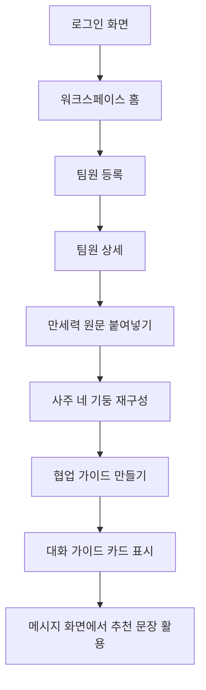
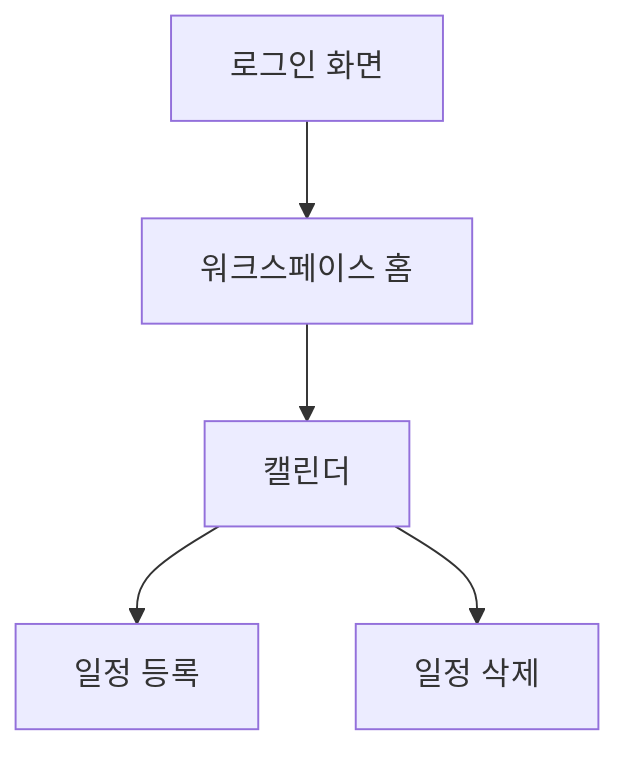
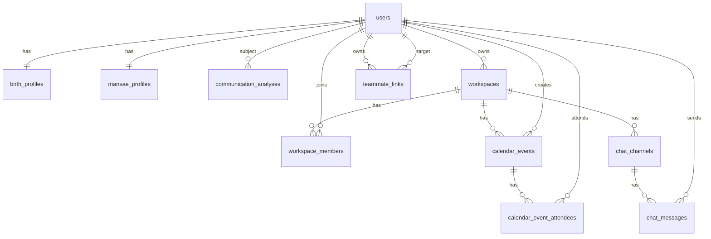

# greenblock 기능명세서

## 1. 문서 목적

이 문서는 greenblock MVP의 기능 범위, 화면 흐름, 데이터 구조, API 초안, 기술 구성, 제약사항을 정리한 설계문서입니다.

대상 독자:

```text
프로젝트 기획자
프론트엔드 개발자
백엔드 개발자
데이터베이스 설계자
향후 배포 담당자
```

## 2. 제품 범위

greenblock은 Slack/Jira형 협업툴 기능에 팀원별 커뮤니케이션 가이드 기능을 결합한 서비스입니다.

MVP 범위:

```text
로그인 화면
워크스페이스 홈
팀원 등록
팀원 상세
만세력 원문 붙여넣기
LLM 기반 협업 가이드 생성
메시지 작성
캘린더 일정 등록/삭제
로컬 상태 저장
Spring Boot 백엔드 API 골격
MySQL 스키마 초안
```

MVP 제외 범위:

```text
운영용 소셜 로그인 OAuth 완료
실시간 채팅
실제 권한 관리
실제 파일 업로드
실제 GitHub repository 연동
외부 만세력 사이트 자동 입력/자동 수집
대운 분석
운영 배포 자동화
```

## 3. 기술 스택

| 영역 | 기술 |
| --- | --- |
| Frontend | React, TypeScript, Vite, React Router |
| Frontend 상태 | React Context, localStorage |
| Backend | Java 17, Spring Boot, Gradle |
| Database | MySQL 8 기준 스키마 |
| LLM | Ollama 로컬 모델, OpenAI API 전환 가능 구조 |
| 개발 스크립트 | PowerShell |

## 4. 시스템 구성



현재 프론트의 주요 데이터는 localStorage에 저장됩니다. 백엔드는 DB 스키마와 API 골격을 갖추고 있으나, 모든 프론트 기능이 백엔드 DB와 완전히 연결된 상태는 아닙니다.

## 5. 주요 화면 구조

| 라우트 | 화면 | 설명 |
| --- | --- | --- |
| `/` | 루트 리다이렉트 | 로그인 여부에 따라 로그인 또는 홈으로 이동 |
| `/login` | 로그인 화면 | 사용자 기본 정보와 출생 정보를 입력 |
| `/home` | 워크스페이스 홈 | 할 일, 분석 대기 팀원, 오늘 일정, 최근 메시지 카드 표시 |
| `/teammates/new` | 팀원 등록 | 팀원 연락처, 역할, 출생 정보 등록 |
| `/teammates/:teammateId` | 팀원 상세 | 분석, 추천 메시지, 일정, 히스토리 확인 |
| `/mansae/:teammateId` | 만세력 붙여넣기 | 사용자가 직접 조회한 만세력 텍스트 입력 및 LLM 분석 |
| `/messages/:teammateId` | 메시지 화면 | 팀원별 추천 문장을 참고해 메시지 작성 |
| `/calendar` | 캘린더 | 일정 등록과 삭제 |

## 6. 사용자 흐름

### 6.1 로그인 후 팀원 분석 흐름



### 6.2 캘린더 흐름



## 7. 기능 명세

### 7.1 로그인

| 항목 | 내용 |
| --- | --- |
| 기능명 | 로그인 및 사용자 프로필 생성 |
| 현재 구현 | 프론트에서 입력값을 받아 localStorage에 저장 |
| 입력값 | 이름, 이메일, 역할, provider, 성별, 생년월일, 태어난 시간, 태어난 장소, 양력/음력 |
| 출력 | 홈 화면 진입 |
| 예외 | 필수값 누락 시 브라우저 기본 validation 또는 폼 validation |
| 향후 구현 | OAuth 기반 소셜 로그인, 백엔드 사용자 저장, 세션/JWT |

### 7.2 워크스페이스 홈

| 항목 | 내용 |
| --- | --- |
| 기능명 | 워크스페이스 대시보드 |
| 목적 | 사용자가 다음에 무엇을 해야 하는지 빠르게 파악 |
| 구성 | 해야 할 일, 분석 대기 팀원, 오늘 일정, 최근 메시지 |
| UI 방향 | Slack식 좌측 내비게이션과 Jira식 카드 보드 결합 |

### 7.3 팀원 등록

| 항목 | 내용 |
| --- | --- |
| 기능명 | 팀원 등록 |
| 입력값 | 이름, 이메일, 역할, 성별, 생년월일, 태어난 시간, 태어난 장소, 양력/음력 |
| 현재 구현 | localStorage에 팀원 추가 |
| 후속 동작 | 팀원 상세 화면에서 분석/메시지/일정 기능 사용 |
| 향후 구현 | 백엔드 DB 저장, 워크스페이스 멤버 권한, 초대 기능 |

### 7.4 팀원 상세

| 항목 | 내용 |
| --- | --- |
| 기능명 | 팀원 상세 보기 |
| 목적 | 특정 팀원의 협업 분석과 액션을 한곳에서 확인 |
| 구성 | 분석, 추천 메시지, 일정, 히스토리 탭 구조 |
| 주요 액션 | 분석 결과 보기, 추천 메시지 작성, 캘린더에 일정 추가 |

### 7.5 만세력 원문 붙여넣기

| 항목 | 내용 |
| --- | --- |
| 기능명 | 수동 만세력 입력 |
| 목적 | 외부 사이트 자동 수집 없이 사용자가 직접 입력한 자료만 분석 |
| 입력값 | 만세력 사이트 등에서 사용자가 직접 복사한 텍스트 |
| 처리 | 연주·월주·일주·시주 감지, 생년월일/시간 기반 보정 |
| 출력 | greenblock 재구성 결과, 인식 메모, 협업 가이드 생성 버튼 |
| 제외 | 대운 분석은 현재 제외 |

정책:

```text
외부 만세력 사이트를 자동 호출하지 않는다.
외부 사이트 화면 디자인을 복제하지 않는다.
붙여넣은 텍스트를 greenblock UI로 재구성한다.
분석 결과는 사용자가 직접 입력한 자료를 바탕으로 생성된다고 안내한다.
```

### 7.6 협업 가이드 만들기

| 항목 | 내용 |
| --- | --- |
| 기능명 | LLM 기반 협업 커뮤니케이션 가이드 생성 |
| 현재 구현 | 프론트가 백엔드 API 호출, 백엔드가 Ollama 또는 OpenAI 호출 |
| 기본 모델 | Ollama `llama3.2:3b` |
| 입력 | 팀원 정보, 감지된 사주 네 기둥, 사용자가 붙여넣은 원문 |
| 출력 | 요약, 대화 참고점, 주의점, 메시지 첫 문장, 회의/업무 요청 방식, 한계 문구 |
| UX | 생성 중 스켈레톤 표시, 재생성 중 기존 결과 블러 처리 |

안전 제한:

```text
채용, 인사평가, 차별 판단에 사용하지 않는다.
성별, 성적 지향, 가족관계, 질병, 재정 상태를 추정하지 않는다.
만세력 결과를 확정적 성격 판단처럼 표현하지 않는다.
```

### 7.7 메시지 작성

| 항목 | 내용 |
| --- | --- |
| 기능명 | 팀원별 메시지 화면 |
| 목적 | 추천 문장을 참고해 협업 메시지를 작성 |
| 현재 구현 | localStorage 기반 메시지 추가 |
| 향후 구현 | 실시간 채팅, 채널 메시지, DM, 알림, 읽음 상태 |

### 7.8 캘린더

| 항목 | 내용 |
| --- | --- |
| 기능명 | 일정 등록 및 삭제 |
| 입력값 | 제목, 날짜, 시간, 팀원, 설명 |
| 현재 구현 | localStorage 기반 일정 추가/삭제 |
| 향후 구현 | 백엔드 저장, 참석자, 반복 일정, 알림 |

## 8. LLM 연동 설계

### 8.1 현재 흐름

```text
사용자 버튼 클릭
frontend requestMansaeAnalysis 호출
POST /api/llm/mansae-analysis
backend가 프롬프트 생성
greenblock.llm.provider 값에 따라 Ollama 또는 OpenAI 호출
backend가 응답을 구조화된 카드 데이터로 반환
frontend가 카드 UI로 표시
```

### 8.2 Provider 정책

| Provider | 용도 | 특징 |
| --- | --- | --- |
| `ollama` | 무료 로컬 테스트 | 비용 없음, 한국어 품질은 모델에 따라 차이 |
| `openai` | 운영 또는 고품질 분석 | API key 필요, 사용량 기반 과금 |
| `local-fallback` | LLM 미설정 시 미리보기 | 실제 LLM 호출 없이 기본 문구 반환 |

### 8.3 프롬프트 원칙

```text
한국어로만 답변하도록 지시한다.
입력에 없는 사람이나 관계를 지어내지 않도록 지시한다.
채용/평가/차별 판단 금지를 명시한다.
만세력은 참고자료이며 메시지 톤과 협업 방식 추천에만 사용하도록 제한한다.
```

## 9. 백엔드 API 초안

| Method | Endpoint | 설명 | 현재 상태 |
| --- | --- | --- | --- |
| GET | `/api/health` | 백엔드 상태 확인 | 구현 |
| POST | `/api/auth/login` | 로그인 payload 수신 | Stub |
| GET | `/api/teammates` | 팀원 목록 조회 | Stub |
| POST | `/api/teammates` | 팀원 생성 payload 수신 | Stub |
| GET | `/api/teammates/{teammateId}/analysis` | 팀원 분석 조회 | Stub |
| GET | `/api/calendar/events` | 일정 목록 조회 | Stub |
| POST | `/api/calendar/events` | 일정 생성 payload 수신 | Stub |
| DELETE | `/api/calendar/events/{eventId}` | 일정 삭제 | Stub |
| POST | `/api/llm/mansae-analysis` | 만세력 기반 협업 가이드 생성 | 구현 |

## 10. 데이터베이스 설계

현재 MySQL 스키마는 운영 연결 전 초안입니다.

주요 테이블:

| 테이블 | 목적 |
| --- | --- |
| `users` | 사용자 기본 계정 |
| `birth_profiles` | 사용자 출생 정보 |
| `mansae_profiles` | 만세력 네 기둥과 원문 payload |
| `communication_analyses` | LLM 협업 분석 결과 |
| `workspaces` | 워크스페이스 |
| `workspace_members` | 워크스페이스 멤버 |
| `teammate_links` | 사용자가 등록한 팀원 관계 |
| `calendar_events` | 일정 |
| `calendar_event_attendees` | 일정 참석자 |
| `chat_channels` | 채팅 채널 |
| `chat_messages` | 채팅 메시지 |

ERD 개요:



정규화 방향:

```text
사용자 기본 정보와 출생 정보를 분리한다.
만세력 정보와 LLM 분석 결과를 분리한다.
워크스페이스 멤버십을 별도 테이블로 관리한다.
팀원 관계는 owner와 target을 분리해 중복을 줄인다.
일정 참석자는 다대다 관계로 분리한다.
채널과 메시지를 분리해 향후 DM/채널 확장을 가능하게 한다.
```

## 11. 프론트엔드 상태 구조

현재 프론트는 `AppStateContext`와 `usePersistentState`로 상태를 관리합니다.

주요 상태:

| 상태 | 설명 |
| --- | --- |
| `currentUser` | 현재 로그인 사용자 |
| `teammates` | 등록된 팀원 목록 |
| `messagesByTeammate` | 팀원별 메시지 |
| `events` | 일정 목록 |

주요 액션:

```text
login
logout
addTeammate
deleteTeammate
sendMessage
addEvent
deleteEvent
```

## 12. 보안 및 개인정보 고려사항

greenblock은 이름, 이메일, 성별, 생년월일, 태어난 시간, 태어난 장소, 만세력 원문, LLM 분석 결과를 다룰 수 있습니다. 실제 서비스 전 개인정보 정책을 명확히 정해야 합니다.

필수 검토 사항:

```text
민감정보 저장 여부
만세력 원문 저장 여부
분석 후 원문 삭제 여부
분석 결과 삭제 기능
사용자 동의 문구
관리자 접근 권한
DB 암호화 또는 컬럼 암호화
로그에 개인정보가 남지 않도록 처리
백업 데이터 보관 기간
```

## 13. 배포 전 필수 변경사항

운영 배포 전 변경해야 할 항목:

```text
VITE_API_BASE_URL을 실제 백엔드 도메인으로 변경
백엔드 CORS를 운영 프론트 도메인으로 제한
DB URL, 계정, 비밀번호를 환경변수로 관리
OAuth provider client id, secret, redirect URI 설정
HTTPS 적용
운영 로그 정책 설정
Ollama 서버 또는 OpenAI API 운영 방식 결정
프론트 localStorage 중심 구조를 백엔드 저장 구조로 전환
권한 관리와 워크스페이스 초대 정책 구현
```

## 14. 오류 및 예외 처리

| 상황 | 현재 처리 | 개선 방향 |
| --- | --- | --- |
| 만세력 원문 미입력 | 안내 메시지 표시 | 입력 예시 강화 |
| LLM 호출 실패 | fallback 결과 표시 | 원인별 에러 메시지 분리 |
| Ollama 미실행 | 백엔드 에러 메시지 | 프론트에서 진단 안내 |
| MySQL 연결 실패 | Spring Boot 로그 표시 | 시작 전 점검 스크립트 |
| 포트 충돌 | 통합 스크립트에서 안내 | 점유 프로세스 종료 가이드 |

## 15. 향후 개발 백로그

우선순위 높음:

```text
프론트 기능을 실제 백엔드 DB와 연결
OAuth 소셜 로그인 구현
개인정보 저장/삭제 정책 확정
만세력 파서 정확도 개선
LLM 결과 저장/재조회 기능
```

우선순위 중간:

```text
워크스페이스 초대
채널/DM 구조 구현
실시간 메시지
캘린더 참석자와 알림
추천 메시지 템플릿 편집
```

우선순위 낮음:

```text
GitHub repository 연동
원격 브랜치 상태 시각화
스프린트 보드
PR/이슈 상태 연동
배포 자동화
```

## 16. 현재 결론

greenblock은 현재 “실제 운영 서비스”가 아니라 “핵심 아이디어를 검증하는 로컬 MVP”입니다. 핵심 기능인 팀원 등록, 만세력 붙여넣기, LLM 기반 협업 가이드 생성, 메시지/캘린더 흐름은 확인할 수 있습니다.

다음 단계에서는 프론트 로컬 상태를 백엔드 DB와 연결하고, 인증/권한/개인정보 정책을 정리한 뒤 운영 배포 구조로 전환하는 것이 좋습니다.
