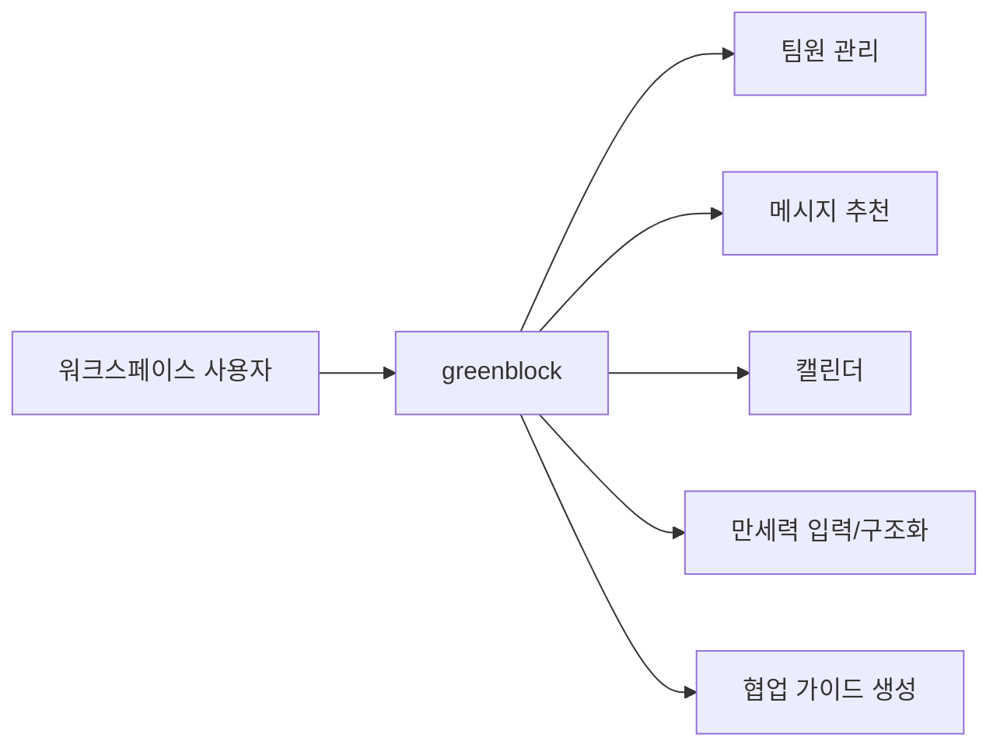
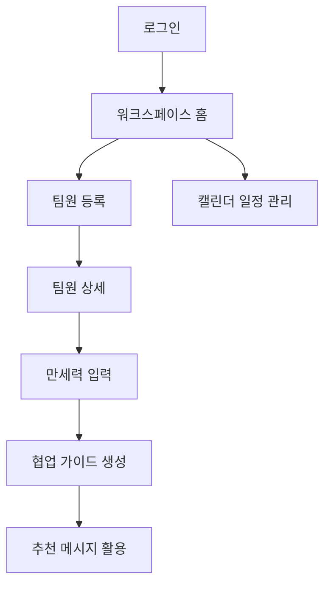

# greenblock 서비스 개요

## 1. 문서 목적

이 문서는 greenblock의 서비스 목적, 문제 정의, 제공 가치, 범위, 주요 사용자와 같은 상위 수준 정보를 정리한 개요 문서다. 상세 기능, API, 테스트 항목은 후속 문서에서 다룬다.

## 2. 서비스 한 줄 소개

greenblock은 팀원의 성향과 협업 맥락을 반영해 더 적절한 메시지, 피드백, 일정 조율 방식을 제안하는 협업 워크스페이스다.

## 3. 서비스 설명

기존 협업툴은 메시지, 일정, 팀원 관리, 프로젝트 진행 상황을 중심으로 동작한다. greenblock은 이 기본 구조 위에 상대에 맞는 커뮤니케이션 가이드를 더한다.

## 3.1 서비스 컨텍스트 다이어그램

사용자는 다음 흐름으로 서비스를 이용한다.

1. 로그인하고 본인 프로필을 입력한다.
2. 팀원을 등록한다.
3. 팀원의 만세력 결과를 텍스트, HTML 복사본, 또는 이미지 형태로 입력한다.
4. 시스템은 이를 구조화하고, LLM을 통해 협업 가이드를 생성한다.
5. 사용자는 메시지 작성, 피드백, 일정 조율에 이 가이드를 참고한다.

greenblock의 목표는 같은 업무 요청도 더 부드럽고 명확하게 전달되도록 돕는 것이다.

## 3.2 대표 사용자 여정

## 4. 해결하려는 문제

팀 협업에서 잦은 마찰은 업무 능력보다 커뮤니케이션 방식 차이에서 자주 발생한다.

- 어떤 사람은 결론부터 듣는 것을 선호한다.
- 어떤 사람은 먼저 배경 설명이 있어야 편하게 받아들인다.
- 어떤 사람은 예의와 표현의 톤에 민감하다.
- 어떤 사람은 질문을 한 번에 많이 받으면 피로해한다.
- 같은 요청도 표현 방식에 따라 압박, 무례함, 모호함으로 해석될 수 있다.

greenblock은 이런 차이를 성향을 고려한 협업 가이드 형태로 보여준다.

## 5. 가치

### 5.1 대화를 시작하기 전에 맥락을 준다

메시지 작성 직전에 상대 팀원에게 어떤 방식으로 말을 꺼내면 좋은지 보여준다.

### 5.2 소통 조율에 사용한다

분석 결과는 협업 상황의 말투와 요청 방식 조율에만 사용한다.

### 5.3 수동 입력 기반으로 법률/보안 리스크를 낮춘다

외부 만세력 사이트를 자동 호출하지 않고, 사용자가 직접 복사한 결과를 greenblock 내부 UI로 재구성한다.

### 5.4 협업툴로서의 기본 기능을 유지한다

팀원 관리, 메시지, 캘린더, 워크스페이스 홈이라는 일반 협업툴 구조를 유지한다.

## 6. 주요 사용자

| 사용자 유형 | 설명 |
| --- | --- |
| 팀 리더 | 팀원별 대화 방식 차이를 줄이고 싶은 사용자 |
| 프로젝트 매니저 | 일정, 메시지, 팀원 상태를 함께 보고 싶은 사용자 |
| 개발자/디자이너 | DM, 요청, 피드백을 더 부드럽게 주고받고 싶은 사용자 |
| 초기 MVP 검증자 | 로컬 환경에서 프로토타입 흐름을 검증하는 사용자 |

## 7. 시스템 범위

### 7.1 현재 MVP 범위

- 로그인 화면
- 워크스페이스 홈
- 팀원 등록 및 팀원 상세
- 만세력 결과 입력
- OCR 및 만세력 구조화
- LLM 기반 협업 가이드 생성
- 메시지 화면
- 캘린더 일정 등록/삭제

### 7.2 현재 MVP 제외 범위

- 실제 카카오 소셜 로그인 완료
- 실시간 채팅
- 실제 권한 관리
- 외부 만세력 사이트 자동 연동
- 운영 배포 자동화
- GitHub 연동

## 8. 성공 기준

greenblock MVP의 성공은 다음 기준으로 판단한다.

- 사용자가 팀원을 등록하고 분석 화면까지 이동할 수 있다.
- 만세력 입력 결과를 시스템이 구조화할 수 있다.
- 협업 가이드가 카드 형태로 표시된다.
- 추천 문장을 메시지 작성 맥락에 활용할 수 있다.
- 일정 등록과 삭제 흐름이 동작한다.

## 9. 운영 원칙

- 분석 대상 데이터는 사용자가 직접 입력한 자료만 사용한다.
- 외부 사이트와 공식 제휴 또는 자동 연동으로 오해하게 만들지 않는다.
- 성별, 성적 지향, 질병, 재정 상태 등 민감한 속성을 추정하지 않는다.
- 분석 결과는 협업 참고용으로만 안내한다.

## 10. 용어 정의

| 용어 | 정의 |
| --- | --- |
| 팀원 | 사용자가 greenblock에 등록한 협업 대상자 |
| 만세력 원문 | 사용자가 외부 사이트에서 직접 복사해 붙여넣은 결과 |
| 네 기둥 | 연주, 월주, 일주, 시주 |
| 협업 가이드 | 성향 해석, 일 스타일, 대화 방식, 메시지 예시를 포함한 안내 결과 |
| readingSignals | 만세력 구조화 결과를 바탕으로 만든 성향 해석용 신호 |

## 11. 사용 기술 스택 및 라이브러리

이 프로젝트 문서 기준의 구현 스택은 아래 사용자가 지정한 라이브러리와 프레임워크만 기준으로 한다.

### 11.1 Frontend

- React 19
- React DOM
- React Router DOM
- TypeScript
- Vite
- ESLint
- @vitejs/plugin-react
- typescript-eslint
- eslint-plugin-react-hooks
- eslint-plugin-react-refresh

### 11.2 Backend

- Java 17
- Spring Boot 3.4.4
- Spring Web
- Spring Data JPA
- Spring Validation
- MySQL Connector/J
- Gradle

### 11.3 AI 구현 가이드 제약

본 MVP 구현과 AI 코딩 가이드는 아래에 정리한 라이브러리와 프레임워크만 사용한다는 원칙을 따른다.  
즉, 별도 상태관리 라이브러리, 별도 UI 프레임워크, 별도 백엔드 프레임워크를 추가하지 않고 아래 스택 범위 안에서 기능을 확장한다.
