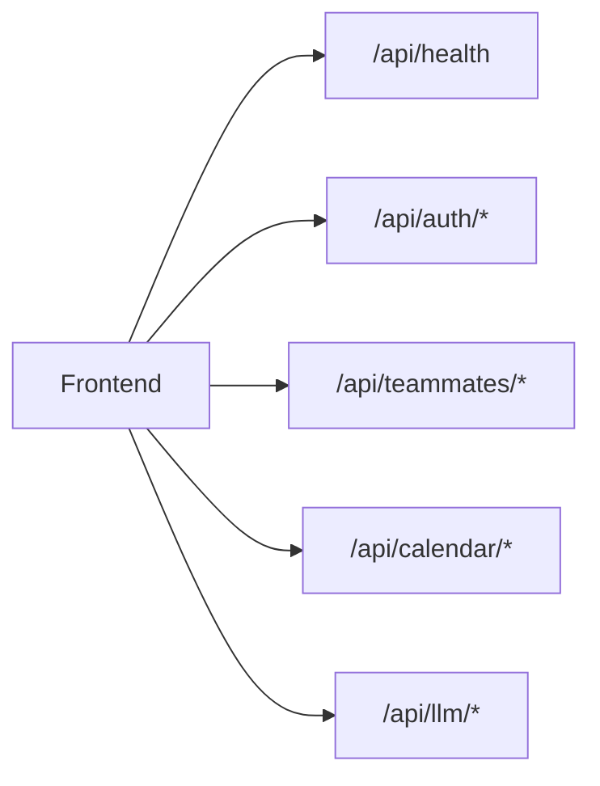
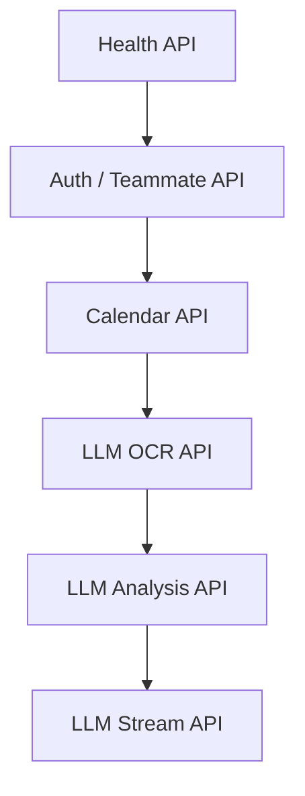

# greenblock API 명세서

## 1. 문서 목적

이 문서는 greenblock MVP의 백엔드 API 범위와 인터페이스를 정리한다.

## 2. 공통 규칙

- Base URL: http://localhost:8080
- Content-Type: application/json
- 문자셋: UTF-8
- 인증: 카카오 로그인 기반 토큰 인증을 적용 대상으로 둔다

## 2.1 API 구성도



## 3. API 목록

| 구분 | Method | Endpoint | 단계 |
| --- | --- | --- | --- |
| Health | GET | /api/health | 1차 |
| Auth | POST | /api/auth/login | 1차 |
| Teammate | GET | /api/teammates | 1차 |
| Teammate | POST | /api/teammates | 1차 |
| Teammate | GET | /api/teammates/{teammateId}/analysis | 1차 |
| Calendar | GET | /api/calendar/events | 1차 |
| Calendar | POST | /api/calendar/events | 1차 |
| Calendar | DELETE | /api/calendar/events/{eventId} | 1차 |
| LLM | POST | /api/llm/mansae-ocr | 1차 |
| LLM | POST | /api/llm/mansae-analysis | 1차 |
| LLM | POST | /api/llm/mansae-analysis/stream | 1차 |

## 4. Health API

### 4.1 서버 상태 조회

- Method: GET
- Endpoint: /api/health
- 설명: 백엔드 서버 상태를 점검한다.

응답 예시:

```json
{
  "status": "ok",
  "service": "greenblock-backend"
}
```

## 5. Auth API

### 5.1 로그인 요청

- Method: POST
- Endpoint: /api/auth/login
- 설명: 로그인 및 사용자 프로필 생성을 위한 엔드포인트

요청 예시:

```json
{
  "email": "yena@example.com",
  "displayName": "김예나",
  "roleTitle": "프로덕트 매니저",
  "provider": "LOCAL",
  "gender": "FEMALE",
  "birthDate": "1992-05-17",
  "birthTime": "07:15",
  "birthPlace": "서울",
  "calendarType": "SOLAR"
}
```

응답 예시:

```json
{
  "message": "Login request accepted",
  "email": "yena@example.com",
  "provider": "LOCAL",
  "birthPlace": "서울"
}
```

## 6. Teammate API

### 6.1 팀원 목록 조회

- Method: GET
- Endpoint: /api/teammates
- 설명: 등록된 팀원 요약 목록을 조회한다.

응답 예시:

```json
[
  {
    "name": "Yena Kim",
    "archetype": "Respect-sensitive planner"
  },
  {
    "name": "Doyun Park",
    "archetype": "Context-first collaborator"
  }
]
```

### 6.2 팀원 등록

- Method: POST
- Endpoint: /api/teammates
- 설명: 팀원 기본 정보를 등록한다.

요청 예시:

```json
{
  "name": "박도윤",
  "email": "doyun@example.com",
  "role": "브랜드 디자이너",
  "gender": "MALE",
  "birthDate": "1994-02-03",
  "birthTime": "01:02",
  "birthPlace": "서울",
  "calendarType": "SOLAR"
}
```

응답 예시:

```json
{
  "message": "Teammate payload accepted",
  "name": "박도윤",
  "email": "doyun@example.com",
  "birthPlace": "서울"
}
```

### 6.3 팀원 분석 조회

- Method: GET
- Endpoint: /api/teammates/{teammateId}/analysis
- 설명: 특정 팀원의 현재 분석 요약을 조회한다.

응답 예시:

```json
{
  "teammateId": 7,
  "mansaeSource": "사용자 입력 자료 기반",
  "archetype": "예의와 맥락을 중시하는 유형",
  "messageGuide": "배경을 먼저 설명하고 요청 범위를 분명히 전달한다."
}
```

## 7. Calendar API

### 7.1 일정 목록 조회

- Method: GET
- Endpoint: /api/calendar/events
- 설명: 현재 일정 목록을 조회한다.

응답 예시:

```json
[
  {
    "title": "Sprint kickoff",
    "startsAt": "2026-04-14T10:00:00",
    "workspaceId": 1
  }
]
```

### 7.2 일정 등록

- Method: POST
- Endpoint: /api/calendar/events
- 설명: 새 일정을 등록한다.

요청 예시:

```json
{
  "workspaceId": 1,
  "createdByUserId": 1,
  "title": "디자인 리뷰",
  "description": "브랜드 시안 검토",
  "startsAt": "2026-06-07T14:00:00",
  "endsAt": "2026-06-07T15:00:00"
}
```

응답 예시:

```json
{
  "message": "Calendar event payload accepted",
  "title": "디자인 리뷰",
  "workspaceId": 1
}
```

### 7.3 일정 삭제

- Method: DELETE
- Endpoint: /api/calendar/events/{eventId}
- 설명: 특정 일정을 삭제한다.

응답 예시:

```json
{
  "message": "Calendar event deleted",
  "eventId": 15
}
```

## 8. LLM API

### 8.1 만세력 OCR

- Method: POST
- Endpoint: /api/llm/mansae-ocr
- 설명: 이미지로 붙여넣은 만세력 결과를 OCR 처리한다.

요청 예시:

```json
{
  "imageDataUrl": "data:image/png;base64,..."
}
```

응답 예시:

```json
{
  "provider": "tesseract",
  "text": "정관 정인 ...",
  "usedFallback": false,
  "note": "OCR 결과를 읽었습니다."
}
```

### 8.2 협업 가이드 생성

- Method: POST
- Endpoint: /api/llm/mansae-analysis
- 설명: 정규화된 만세력 결과와 팀원 정보를 바탕으로 협업 가이드를 생성한다.

요청 본문 주요 필드:

| 필드 | 설명 |
| --- | --- |
| teammateName | 팀원 이름 |
| role | 역할 |
| gender | 성별 |
| birthDate | 생년월일 |
| birthTime | 태어난 시간 |
| birthPlace | 태어난 장소 |
| calendarType | 양력/음력 |
| parsedMansaeSummary | greenblock 요약 |
| normalizedMansaeJson | 정규화 JSON |
| mansaeRawText | 사용자가 붙여넣은 원문 |

응답 본문 주요 필드:

| 필드 | 설명 |
| --- | --- |
| provider | ollama, openai, local-fallback |
| model | 사용한 모델명 |
| analysisText | 원문 분석 결과 |
| usedFallback | fallback 여부 |
| structuredAnalysis | 카드 UI용 구조화 응답 |

### 8.3 스트리밍 협업 가이드 생성

- Method: POST
- Endpoint: /api/llm/mansae-analysis/stream
- 설명: SSE 방식으로 분석 초안을 먼저 받고, 최종 구조화 결과를 반환한다.
- Response Type: text/event-stream

이벤트 종류:

| event | 설명 |
| --- | --- |
| meta | provider, model 정보 |
| chunk | 생성 중 텍스트 |
| done | 최종 결과 |
| error | 오류 메시지 |

## 9. 오류 처리 원칙

| 상황 | 처리 |
| --- | --- |
| 잘못된 요청 본문 | 400 Bad Request |
| LLM 호출 실패 | 오류 메시지 포함 응답 또는 fallback |
| OCR 실패 | usedFallback=true와 note 전달 |
| 서버 기동 불가 | 프론트에서 요청 실패 처리 |

## 10. 향후 API 확장

- 카카오 OAuth 로그인
- 팀원 수정/삭제 API
- 분석 결과 저장/재조회 API
- 메시지 CRUD API
- 캘린더 참석자 API
- 워크스페이스/채널 API

## 11. API 테스트 우선순위


