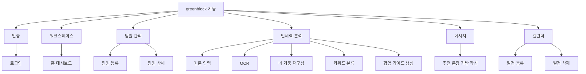
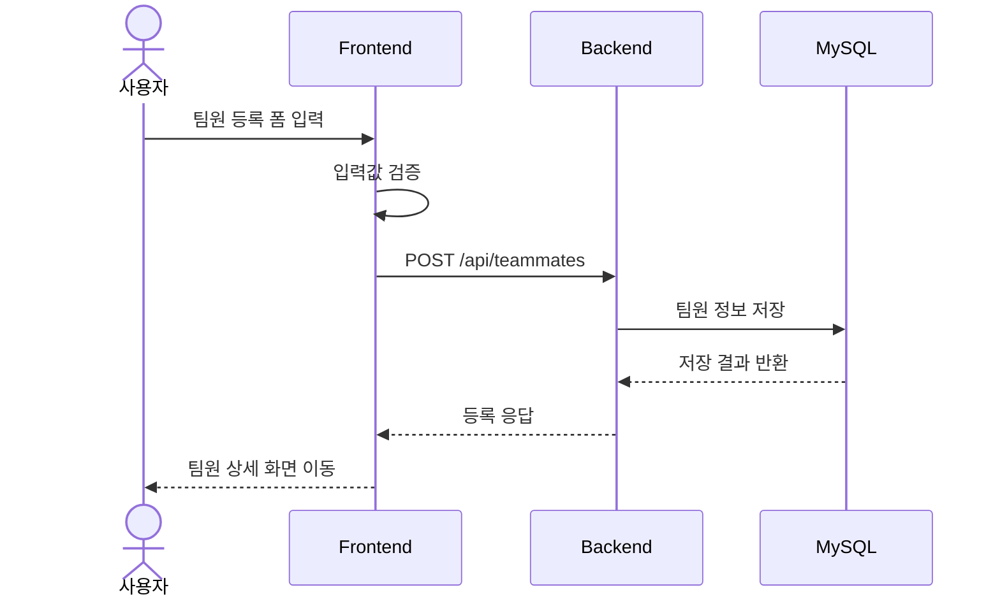
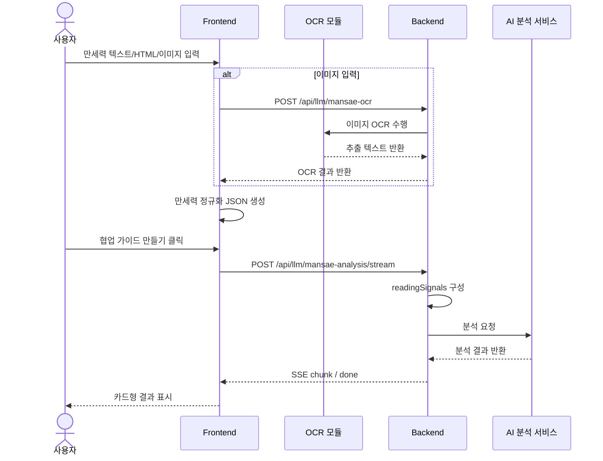
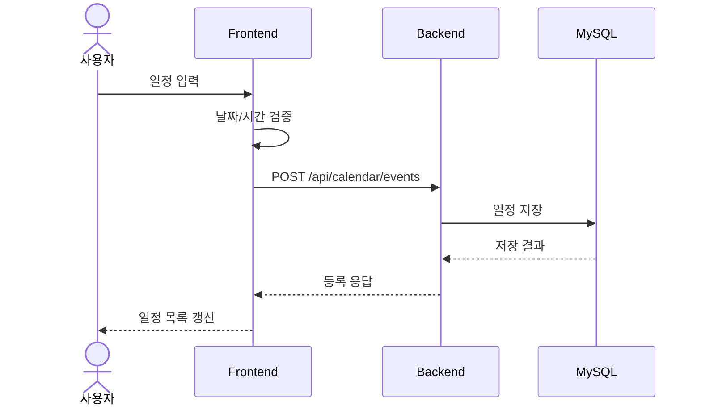
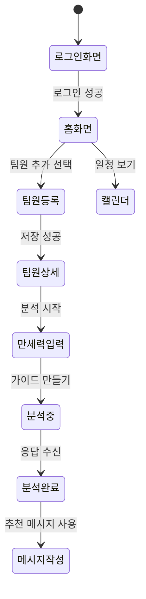

# greenblock 기능 명세서

## 1. 문서 목적

이 문서는 greenblock MVP의 기능 단위를 식별하고, 각 기능의 목적, 입력, 처리, 출력, 예외 상황을 정리한다.

## 2. 기능 분류

| 대분류 | 기능 |
| --- | --- |
| 인증 | 로그인 |
| 워크스페이스 | 홈 대시보드 조회 |
| 팀원 관리 | 팀원 등록, 팀원 상세 조회 |
| 만세력 분석 | 원문 입력, OCR, 네 기둥 재구성, 키워드 분류, 협업 가이드 생성 |
| 메시지 | 추천 문장 기반 메시지 작성 |
| 캘린더 | 일정 등록, 일정 삭제 |

## 2.1 기능 분해도

## 3. 기능 상세

### 3.1 F-01 로그인

| 항목 | 내용 |
| --- | --- |
| 목적 | 사용자를 워크스페이스에 진입시킨다 |
| 초기 저장 방식 | 프론트 localStorage 기반 |
| 입력 | 이름, 이메일, 역할, 출생 정보 |
| 처리 | 프로필 생성 후 홈 화면 이동 |
| 출력 | 홈 화면 |
| 예외 | 필수값 누락 시 저장 불가 |

### 3.2 F-02 워크스페이스 홈 조회

| 항목 | 내용 |
| --- | --- |
| 목적 | 사용자가 다음 행동을 빠르게 선택하도록 돕는다 |
| 입력 | 로그인 사용자 상태 |
| 처리 | 할 일, 일정, 최근 메시지, 분석 대기 팀원 카드 구성 |
| 출력 | 홈 보드 UI |

### 3.3 F-03 팀원 등록

| 항목 | 내용 |
| --- | --- |
| 목적 | 분석 및 메시지 추천 대상 팀원을 등록한다 |
| 입력 | 이름, 역할, 이메일, 성별, 생년월일, 시간, 장소, 양력/음력 |
| 처리 | 초기 버전은 프론트 상태 저장을 사용하고, 확장 단계에서는 DB 저장을 적용한다 |
| 출력 | 팀원 상세 이동 |
| 예외 | 필수값 누락, 형식 오류 |

### 3.4 F-04 팀원 상세 조회

| 항목 | 내용 |
| --- | --- |
| 목적 | 특정 팀원의 협업 정보와 다음 액션을 한곳에서 보여준다 |
| 입력 | 팀원 ID |
| 처리 | 분석 상태, 메시지, 일정 링크 표시 |
| 출력 | 팀원 상세 화면 |

### 3.5 F-05 만세력 결과 입력

| 항목 | 내용 |
| --- | --- |
| 목적 | 분석용 만세력 결과를 입력받는다 |
| 입력 | 텍스트, HTML 복사본, 이미지 |
| 처리 | HTML 우선 파싱, 텍스트 fallback, OCR fallback |
| 출력 | 재구성된 네 기둥, 출생 정보, 키워드 분류 |
| 예외 | 입력 없음, OCR 실패, 불완전한 복사본 |

### 3.6 F-06 협업 가이드 생성

| 항목 | 내용 |
| --- | --- |
| 목적 | 팀원별 성향 해석과 커뮤니케이션 가이드를 생성한다 |
| 입력 | 팀원 정보, 정규화 JSON, 원문 |
| 처리 | readingSignals 생성, LLM 호출, 구조화 응답 생성 |
| 출력 | 요약, 성향 해석, 일 스타일, 대화 방식, 주의점, 메시지 예시 |
| 예외 | LLM 지연, 스트리밍 실패, AI 분석 서비스 미설정 |

### 3.7 F-07 메시지 작성

| 항목 | 내용 |
| --- | --- |
| 목적 | 추천 문장을 참고해 메시지를 작성한다 |
| 입력 | 팀원 선택, 메시지 본문 |
| 처리 | 로컬 상태에 메시지 반영 |
| 출력 | 메시지 히스토리 갱신 |

### 3.8 F-08 캘린더 일정 등록/삭제

| 항목 | 내용 |
| --- | --- |
| 목적 | 일정을 기록하고 제거한다 |
| 입력 | 제목, 설명, 시작/종료 시각 |
| 처리 | 일정 목록 업데이트 |
| 출력 | 갱신된 일정 목록 |

## 4. 비즈니스 규칙

- 분석 결과는 협업 참고용으로만 사용한다.
- 외부 만세력 사이트를 자동 호출하지 않는다.
- 현재 대운 구조는 저장할 수 있으나 해석 문장의 근거로 쓰지 않는다.
- MySQL은 저장소로 관리하며 유스케이스 액터로 두지 않는다.
- AI 분석 서비스는 협업 가이드 생성 기능의 보조 시스템이다.

## 5. 주요 시퀀스 다이어그램

### 5.1 팀원 등록 시퀀스

### 5.2 만세력 분석 시퀀스

### 5.3 캘린더 등록 시퀀스

## 6. 단계별 적용 범위

| 기능 | 1차 범위 | 확장 범위 |
| --- | --- | --- |
| 로그인 | 기본 로그인 흐름 | 카카오 OAuth 연동 |
| 팀원 등록 | 등록과 상세 조회 | DB 저장 및 수정/삭제 |
| 협업 가이드 | 분석 생성과 결과 표시 | 저장 및 재조회 |
| 메시지 | 작성 흐름과 추천 문장 표시 | 저장 및 히스토리 |
| 캘린더 | 일정 등록과 삭제 | DB 연동 및 참석자 기능 |

## 7. 상태 전이 흐름

