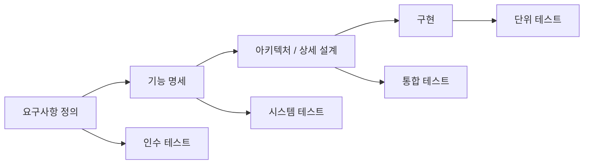
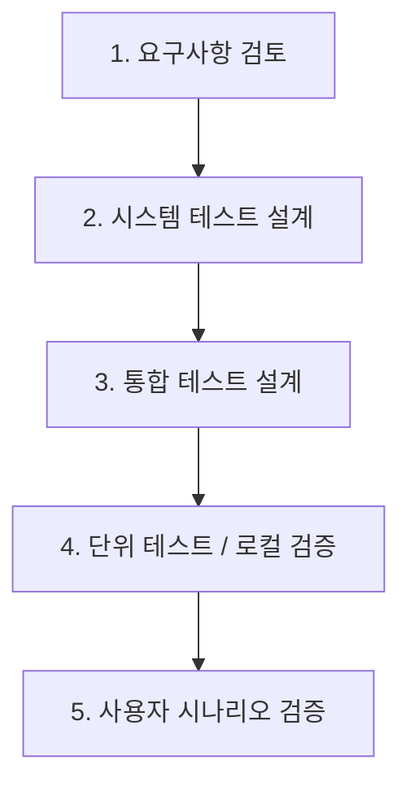

# greenblock 테스트케이스

## 1. 문서 목적

이 문서는 greenblock MVP에 대해 기능 검증, 예외 처리, 통합 흐름을 테스트하기 위한 케이스를 정의한다.

## 1.1 테스트 기준 모델

본 문서의 테스트 전략은 V-모델(V-Model) 기준으로 정리한다.  
요구사항과 설계 산출물의 각 단계가 대응되는 테스트 단계와 연결되도록 정의한다.

## 1.2 V-모델 해석 기준

| V-모델 단계 | greenblock 대응 문서 | 대응 테스트 |
| --- | --- | --- |
| 요구사항 정의 | 서비스 개요, 유스케이스 | 인수 테스트 |
| 기능 명세 | 기능명세서, API 명세서 | 시스템 테스트 |
| 아키텍처/상세 설계 | 아키텍처 문서, 데이터 모델 | 통합 테스트 |
| 구현 | frontend/backend 코드 | 단위 테스트 |

## 1.3 현재 문서의 표현 원칙

이 문서는 V-모델 기준으로 테스트를 설계하고 정리했다.  
실제 자동화 테스트와 전수 실행 범위는 MVP 진행 단계에 따라 달라질 수 있으므로 계획, 수동 검증, 자동화 대상을 구분해서 적는다.

## 2. 테스트 범위

- 로그인
- 팀원 등록
- 만세력 입력과 파싱
- OCR 처리
- 협업 가이드 생성
- 메시지 작성
- 캘린더 일정 등록/삭제

## 2.1 테스트 순서

greenblock 테스트는 V-모델 기준으로 다음 순서를 따른다.

1. 요구사항 검토와 인수 기준 정의
2. 기능 명세 기반 시스템 테스트 항목 도출
3. 아키텍처와 API 연결 기준의 통합 테스트 항목 도출
4. 구현 코드 기준의 단위 테스트 또는 로컬 검증 수행
5. 화면 흐름 기준의 사용자 시나리오 검증

## 3. 테스트케이스 목록

| ID | 구분 | 테스트 시나리오 | 기대 결과 |
| --- | --- | --- | --- |
| TC-LOGIN-001 | 로그인 | 필수값을 모두 입력하고 로그인한다 | 홈 화면으로 이동한다 |
| TC-LOGIN-002 | 로그인 | 필수값 없이 제출한다 | 오류 또는 제출 방지 상태가 보인다 |
| TC-TEAM-001 | 팀원 관리 | 팀원을 정상 등록한다 | 팀원 목록과 상세에 반영된다 |
| TC-TEAM-002 | 팀원 관리 | 이름 없이 등록을 시도한다 | 저장되지 않는다 |
| TC-MANSAE-001 | 만세력 | 일반 텍스트 복사본을 붙여넣는다 | 네 기둥이 재구성된다 |
| TC-MANSAE-002 | 만세력 | HTML 복사본을 붙여넣는다 | 표 구조가 우선 반영된다 |
| TC-MANSAE-003 | 만세력 | 이미지만 붙여넣는다 | OCR 결과가 textarea에 반영된다 |
| TC-MANSAE-004 | 만세력 | 잘린 이미지로 OCR을 수행한다 | OCR 실패 안내 또는 낮은 신뢰도 결과가 보인다 |
| TC-LLM-001 | LLM | 정상 입력으로 분석을 요청한다 | 협업 가이드 카드가 표시된다 |
| TC-LLM-002 | LLM | 스트리밍이 지연된다 | 일반 분석 응답으로 전환된다 |
| TC-LLM-003 | LLM | AI 분석 서비스 연결 정보 없이 분석한다 | 대체 응답 또는 오류 안내가 표시된다 |
| TC-MSG-001 | 메시지 | 추천 문장을 참고해 메시지를 작성한다 | 메시지 목록에 추가된다 |
| TC-CAL-001 | 캘린더 | 일정을 정상 등록한다 | 일정 목록이 갱신된다 |
| TC-CAL-002 | 캘린더 | 일정을 삭제한다 | 일정 목록에서 제거된다 |

## 4. 상세 테스트케이스

### 4.1 로그인

| 항목 | 내용 |
| --- | --- |
| ID | TC-LOGIN-001 |
| 목적 | 로그인 기본 흐름 검증 |
| 사전조건 | 애플리케이션이 실행 중이어야 한다 |
| 절차 | 1. 로그인 화면 진입 2. 필수 항목 입력 3. 제출 |
| 기대 결과 | 홈 화면으로 이동 |

### 4.2 팀원 등록

| 항목 | 내용 |
| --- | --- |
| ID | TC-TEAM-001 |
| 목적 | 팀원 등록 기능 검증 |
| 사전조건 | 로그인 상태 |
| 절차 | 1. 팀원 등록 화면 이동 2. 필수값 입력 3. 저장 |
| 기대 결과 | 팀원 상세 화면 이동 및 목록 반영 |

### 4.3 만세력 파싱

| 항목 | 내용 |
| --- | --- |
| ID | TC-MANSAE-001 |
| 목적 | 텍스트 기반 만세력 파싱 검증 |
| 사전조건 | 팀원 상세에서 분석 화면 진입 |
| 절차 | 1. 만세력 텍스트 붙여넣기 2. 재구성 결과 확인 |
| 기대 결과 | 연주/월주/일주/시주가 표시되고 출생 정보가 추출됨 |

### 4.4 OCR 처리

| 항목 | 내용 |
| --- | --- |
| ID | TC-MANSAE-003 |
| 목적 | 이미지 기반 OCR 파이프라인 검증 |
| 사전조건 | 클립보드에 만세력 이미지가 있어야 함 |
| 절차 | 1. 이미지 붙여넣기 2. OCR 완료 대기 |
| 기대 결과 | OCR 텍스트와 재구성 결과가 보임 |

### 4.5 협업 가이드 생성

| 항목 | 내용 |
| --- | --- |
| ID | TC-LLM-001 |
| 목적 | LLM 분석 성공 검증 |
| 사전조건 | 만세력 입력이 완료되어 있어야 함 |
| 절차 | 1. 협업 가이드 만들기 클릭 2. 결과 대기 |
| 기대 결과 | 요약, 성향 해석, 일 스타일, 대화 방식 카드가 출력됨 |

### 4.6 스트리밍 지연 처리

| 항목 | 내용 |
| --- | --- |
| ID | TC-LLM-002 |
| 목적 | 스트리밍 지연 시 대체 경로 검증 |
| 사전조건 | LLM 응답 지연 상황 조성 |
| 절차 | 1. 분석 요청 2. 스트림 응답 지연 확인 |
| 기대 결과 | 일반 분석 응답으로 전환 후 결과 표시 |

## 5. 테스트 관점별 체크리스트

### 5.1 기능 테스트

- 필수 입력 검증
- 팀원 생성/조회
- 일정 생성/삭제
- 메시지 추가
- 분석 결과 카드 표시

### 5.2 통합 테스트

- 프론트와 백엔드 연결
- 백엔드와 LLM 연결
- 백엔드와 MySQL 연결
- OCR 결과와 파서 연결

### 5.3 예외 테스트

- 백엔드 미기동
- Ollama 미기동
- OCR 실패
- 잘못된 만세력 입력
- 타임아웃 발생

### 5.4 비기능 테스트

- 긴 텍스트 붙여넣기 시 응답성
- 이미지 OCR 처리 시간
- 스트리밍 첫 응답 시간
- MySQL 연결 실패 복구 가능성

## 6. V-모델 기준 테스트 매핑표

| 테스트 레벨 | 주요 대상 | 대표 케이스 |
| --- | --- | --- |
| 인수 테스트 | 서비스 목표와 사용자 흐름 | 팀원 등록 후 분석 결과까지 도달 가능해야 함 |
| 시스템 테스트 | 기능 단위 완성도 | 로그인, 팀원 등록, OCR, LLM 분석, 캘린더 |
| 통합 테스트 | 프론트-백엔드-DB-LLM 연결 | /api/llm/mansae-analysis, /api/calendar/events |
| 단위 테스트/로컬 검증 | 함수/모듈/컨트롤러 | 파서, 타입 체크, 컨트롤러 컴파일, 요청 포맷 |

## 7. 예정 검증 항목 예시

초기 버전 기준으로 다음 항목을 검증 대상으로 둔다.

- Frontend 타입 체크
- Frontend 빌드 가능 여부 확인
- Backend 컴파일 가능 여부 확인
- Backend 기동 가능 여부 확인
- OCR 입력 흐름 확인
- LLM 분석 요청과 타임아웃 케이스 확인

정식 자동화 테스트 스위트는 후속 단계에서 추가한다.
