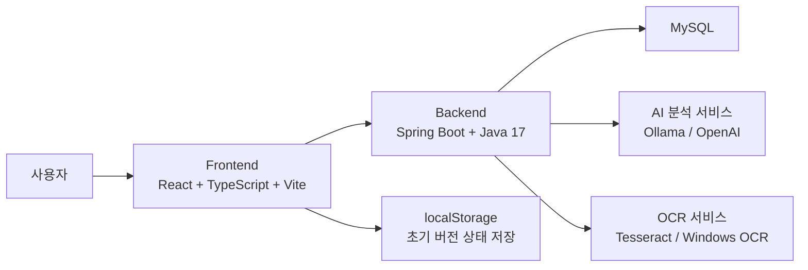
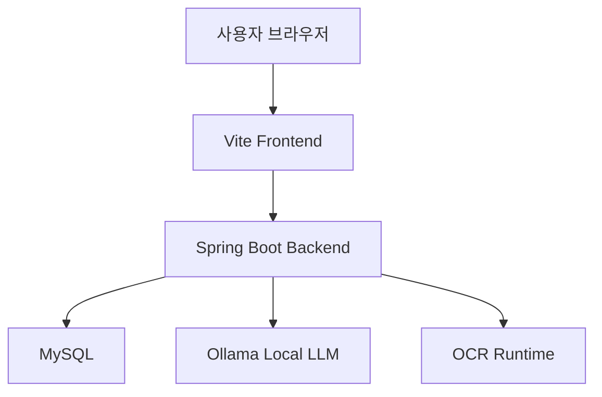
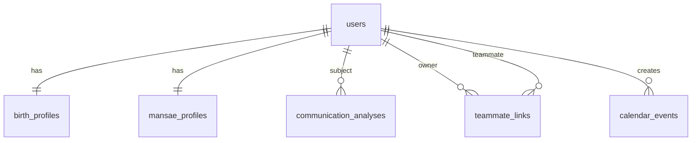
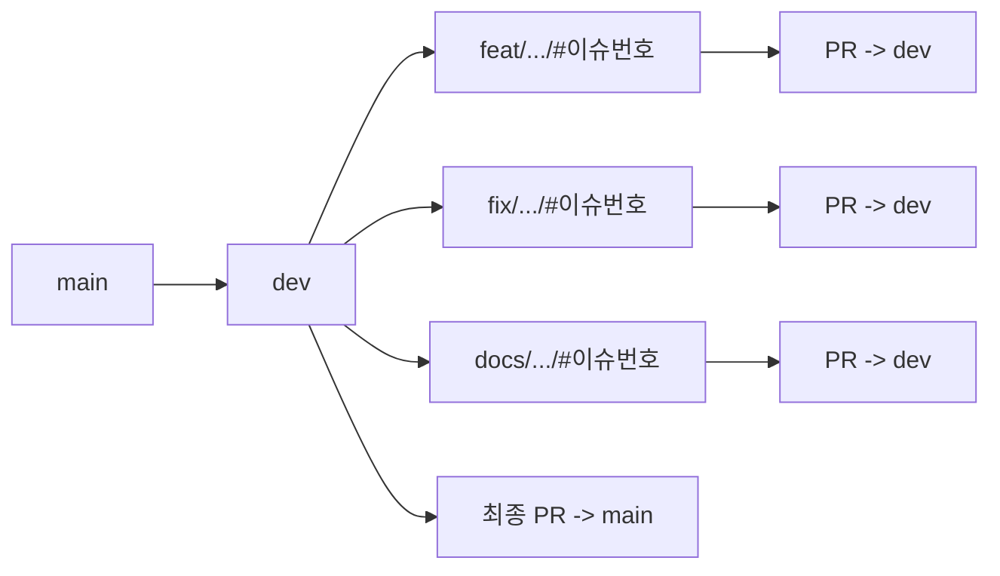

# greenblock 아키텍처 및 비기능 요구사항

## 1. 문서 목적

이 문서는 greenblock의 시스템 아키텍처, 데이터 구조, 외부 연계 요소, 그리고 비기능 요구사항을 정리한다.

## 2. 아키텍처 개요

greenblock은 프론트엔드, 백엔드, MySQL, AI 분석 서비스, OCR 구성으로 나뉜다.



## 2.1 배포 관점 구조도



## 3. 컴포넌트 역할

| 컴포넌트 | 역할 |
| --- | --- |
| Frontend | 화면, 라우팅, 폼 입력, 상태 관리, 백엔드 API 호출 |
| Backend | 입력 검증, OCR 호출, LLM 프롬프트 구성, 구조화 응답 생성 |
| MySQL | 사용자, 팀원, 일정, 만세력, 분석 결과 저장 |
| Ollama/OpenAI | 협업 가이드 생성 |
| OCR 모듈 | 이미지 붙여넣기 결과를 텍스트로 변환 |

## 3.1 사용 기술 스택 및 라이브러리

### Frontend

- React
- React DOM
- React Router DOM
- TypeScript
- Vite
- ESLint
- @vitejs/plugin-react
- typescript-eslint
- eslint-plugin-react-hooks
- eslint-plugin-react-refresh

### Backend

- Java 17
- Spring Boot
- Spring Web
- Spring Data JPA
- Spring Validation
- MySQL Connector/J
- Gradle

### 적용 원칙

본 프로젝트는 아래에 정리한 기술 스택과 라이브러리만 사용해 구현한다는 원칙을 둔다.  
즉, AI 코딩 가이드와 구현 가이드는 아래 스택 범위 안에서 기능을 추가하도록 제한한다.

## 4. MySQL과 Ollama의 위치

### 4.1 MySQL

MySQL은 시스템 내부 저장소다. 유스케이스 문서에서는 액터로 두지 않고 아키텍처 구성요소로 정리한다.

### 4.2 Ollama/OpenAI

Ollama/OpenAI는 시스템 외부에서 연계되는 분석 서비스다. 유스케이스 문서에서는 보조 액터로, 아키텍처 문서에서는 외부 연계 컴포넌트로 정리한다.

## 5. 데이터 모델 개요

### 5.1 엔티티

| 엔티티 | 설명 |
| --- | --- |
| users | 사용자 기본 계정 |
| birth_profiles | 사용자 출생 정보 |
| mansae_profiles | 만세력 결과 원문과 네 기둥 |
| communication_analyses | 분석 결과 |
| teammate_links | 사용자-팀원 관계 |
| calendar_events | 일정 |

### 5.2 ERD



### 5.3 저장 정책

- 사용자 기본 정보와 출생 정보를 분리 저장한다.
- 만세력 원문과 분석 결과를 분리 저장한다.
- 팀원 관계를 owner/teammate 구조로 관리한다.
- 일정은 workspace 기준으로 확장 가능하게 설계한다.

## 6. 비기능 요구사항

### 6.1 성능

| 항목 | 요구사항 |
| --- | --- |
| 홈 화면 진입 | 일반 로컬 환경에서 즉시 렌더링 |
| OCR 처리 | 수 초 내 1차 결과 제공 |
| 협업 가이드 생성 | 스트리밍 첫 응답이 가능한 한 빠르게 도착해야 함 |
| 전체 분석 | 지나치게 긴 프롬프트를 피하고 적절한 응답 길이를 유지해야 함 |

### 6.2 보안

| 항목 | 요구사항 |
| --- | --- |
| 환경변수 | DB 비밀번호, API 키를 코드에 하드코딩하지 않는다 |
| 인증 | 향후 카카오 로그인 기반 인증 필요 |
| CORS | 운영 배포 시 허용 도메인을 제한해야 함 |
| 로그 | 개인정보와 원문 데이터가 과도하게 로그에 남지 않아야 함 |

### 6.3 개인정보

| 항목 | 요구사항 |
| --- | --- |
| 수집 최소화 | 분석에 필요한 정보만 저장 |
| 보관 정책 | 만세력 원문 저장/삭제 정책을 별도 정의 |
| 안내 문구 | 분석이 협업 참고용임을 명시 |
| 민감정보 취급 | 성향 해석을 평가 지표처럼 사용하지 않음 |

### 6.4 가용성

| 항목 | 요구사항 |
| --- | --- |
| 백엔드 미기동 | 프론트는 요청 실패를 적절히 처리해야 함 |
| Ollama 지연 | 스트리밍 또는 일반 응답 대체 경로가 있어야 함 |
| DB 연결 실패 | 서버 시작 로그와 점검 절차가 있어야 함 |

### 6.5 유지보수성

| 항목 | 요구사항 |
| --- | --- |
| 폴더 구조 | frontend, backend, docs 분리 유지 |
| API 경계 | 프론트와 백엔드 책임을 분리 |
| 문서화 | 유스케이스, API, 기능명세, 테스트케이스 유지 |
| LLM 공급자 교체 | Ollama/OpenAI를 설정으로 전환 가능해야 함 |

## 7. 배포 관점 메모

초기 버전은 로컬 실행을 기준으로 설계한다. 운영 단계에서는 다음 항목을 고려한다.

- 카카오 OAuth 설정
- 운영용 MySQL 연결
- HTTPS
- CORS 제한
- 로그/모니터링
- 개인정보 보관 정책

## 8. 형상관리 및 협업 규칙

## 8.1 브랜치 전략

greenblock은 main, dev, feature branch 구조를 따른다.

- main
  운영 또는 릴리즈 기준 브랜치
- dev
  main에서 분기한 통합 개발 브랜치
- feature branch
  각 작업 단위별 세부 기능 브랜치



## 8.2 브랜치 이름 규칙

브랜치 이름은 아래 형식을 따른다.

종류/도메인/작업이름/#이슈번호

예시:

- feat/frontend/workspace-flow/#3
- feat/backend/collaboration-api/#4
- chore/dev/local-run/#5
- docs/project/specification/#6

## 8.3 이슈 기반 작업 규칙

- 브랜치를 만들기 전에 먼저 GitHub Issue를 만든다.
- 브랜치 이름에는 실제 이슈 번호를 넣는다.
- placeholder 번호를 쓰지 않는다.
- 기능 브랜치는 dev를 기준으로 만든다.

## 8.4 PR 생성 규칙

- 기능 브랜치를 원격에 push하면 해당 브랜치에서 dev로 PR을 생성한다.
- 각 기능 브랜치마다 별도의 PR을 만든다.
- 리뷰 후 기능 브랜치를 dev에 병합한다.
- 충분한 기능이 쌓이면 마지막에 dev -> main PR을 만든다.

## 8.5 커밋 메시지 규칙

커밋 메시지는 태그 접두사를 사용한다.

- [FEAT]
- [FIX]
- [REFACTOR]
- [CHORE]
- [DOCS]

예시:

- [FEAT] 로그인 CRUD 기능 설정
- [FIX] 로그인 리다이렉트 URI 오류 해결
- [REFACTOR] 만세력 파서 정규화 로직 정리

## 8.6 PR 템플릿 구조

현재 PR 템플릿은 다음 구조를 따른다.

```text
## 작업 요약
## 변경 사항
## 화면 / 동작 확인
## 테스트
## 이슈
## 참고 사항
```

## 8.7 PR 운영 규칙

- Assignee는 레포지토리 소유자 wlqgkrry로 지정한다.
- 라벨은 작업 성격에 맞춰 지정한다.
  - [FEAT] -> enhancement
  - [FIX] -> bug
  - [CHORE] -> chore
  - [DOCS] -> documentation
  - [REFACTOR] -> refactor 또는 이에 준하는 라벨
- Reviewer는 GitHub 제약상 PR 작성자 본인으로 지정할 수 없으므로 별도 지정하거나 비워둔다.
- Project 연결은 필요 시 GitHub Project에 연결한다.

## 8.8 작업 순서 규칙

1. 이슈 생성
2. dev 기준 feature branch 생성
3. 기능 구현
4. 세부 커밋 작성
5. 원격 push
6. feature -> dev PR 생성
7. 코드리뷰
8. 승인 후 dev 병합
9. 릴리즈 시 dev -> main PR 생성

## 8.9 Codex 협업 규칙

- 사용자의 명시적 요청 전에는 임의로 commit/push하지 않는다.
- 큰 기능 단위나 리뷰 단위가 생길 때 commit/push 필요성을 설명하고 승인받는다.
- 삭제는 신중히 처리하고, 파일 삭제는 별도 확인 후 진행한다.

## 9. 추가로 유지하면 좋은 산출물

이번 문서 묶음 외에 다음 자료를 계속 관리하면 좋다.

- ADR: 주요 기술 선택 이유 기록
- 화면 상태 전이도
- DB 데이터 사전
- 운영 체크리스트
- 결함 목록 및 개선 백로그
